<!--

The comments were given by the lecturers. This can be handy for us or other developers

## Please complete the following instructions before committing the **final version** on the project
Please **add** any **instructions** required to: 
* make your application work if applicable 
* be able to test the application (credentials, populated db, ...)
* view the wireframes.

Also clarify
* If there are known **bugs**.
* If you haven't managed to finish certain required functionality.

## Instructions for testing locally
* Run the mars-server with gradle run (through your IDE)
* Open the mars-client in phpstorm/webstorm
  * Navigate to the index.html
  * Click on a browser icon at the top right of your IDE to host the mars-client.
  
## Instruction for testing the web client locally with a deployed mars-server
* Open the mars-client in phpstorm
  * Copy the following settings to **config.json** (make sure to replace the XX)
```json
      {
        "host": "https://project-ii.ti.howest.be",
        "folder": "",
        "group": "mars-XX"
      }
```
  * Navigate to the index.html
  * Click on a browser icon at the top right of your IDE to host the mars-client.
  * Make sure to undo the settings once you are done testing the remote server!

## Instructions for local quality checks
You can run the validators for html, CSS and JS rules locally. 

Make sure **npm** is installed.

There is no need to push to the server to check if you are compliant with our rules. 

In the interest of sparing the server, please result to local testing as often as possible. 

If everyone pushes to test, the remote will not last. 

Open a terminal in your IDE
  - Make sure you are in the root folder of the client project.
  - Execute `npm install` this step is only needed once.
  - Execute `npm run validate-local` for linux/mac users.
  - Execute `npm run validate-local-win` for Windows users. 
  - If there are errors, the program execution will halt and show the first error
  - If there are no errors, a report file will be generated in the `.scannerworks/` directory. 
    - You will find the link to the sonar report in this file 

Hint:

If you want to skip ci remotely, include `[ci skip]` in your commit message. 

This is convenient for when you want to quickly add a certain commit, but do not wish to trigger the whole CI sequence. 

## Default files

### CSS 
The `reset.css` has already been supplied, but it's up to you and your team to add other styles. 

### JavaScript
A demonstration for connecting with the API has already been set up. 

We urge you to divide your JS files into many small JS files.  -->

<!-- # Mars web project group-02
This is the client-side start project for the Analysis and Development project.

Create your client-side project in this repo.

## Important public urls  
* Web project: https://project-ii.ti.howest.be/mars-02/
* Sonar reports: https://sonar.ti.howest.be/dashboard?id=2022.project-ii%3Amars-client-02

## Please complete the following instructions before committing the **final version** on the project
Please **add** any **instructions** required to: 
* make your application work if applicable 
* be able to test the application (credentials, populated db, ...)
* view the wireframes.

Also clarify
* If there are known **bugs**.
* If you haven't managed to finish certain required functionality.

## Instructions for testing locally
* Run the mars-server with gradle run (through your IDE)
* Open the mars-client in phpstorm/webstorm
  * Navigate to the index.html
  * Click on a browser icon at the top right of your IDE to host the mars-client.
  
## Instruction for testing the web client locally with a deployed mars-server
* Open the mars-client in phpstorm
  * Copy the following settings to **config.json** (make sure to replace the XX)
```json
      {
        "host": "https://project-ii.ti.howest.be",
        "folder": "",
        "group": "mars-XX"
      }
```
  * Navigate to the index.html
  * Click on a browser icon at the top right of your IDE to host the mars-client.
  * Make sure to undo the settings once you are done testing the remote server!

## Instructions for local quality checks
You can run the validators for html, CSS and JS rules locally. 

Make sure **npm** is installed.

There is no need to push to the server to check if you are compliant with our rules. 

In the interest of sparing the server, please result to local testing as often as possible. 

If everyone pushes to test, the remote will not last. 

Open a terminal in your IDE
  - Make sure you are in the root folder of the client project.
  - Execute `npm install` this step is only needed once.
  - Execute `npm run validate-local` for linux/mac users.
  - Execute `npm run validate-local-win` for Windows users. 
  - If there are errors, the program execution will halt and show the first error
  - If there are no errors, a report file will be generated in the `.scannerworks/` directory. 
    - You will find the link to the sonar report in this file 
-->
# Events United Client

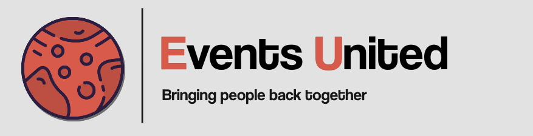

This is the client-side start project for the Analysis and Development project.


# Table Of Contents

- [Events United Client](#events-united-client)
- [Table Of Contents](#table-of-contents)
  - [💡 Getting started](#-getting-started)
    - [Clone the repository](#clone-the-repository)
    - [CLI](#cli)
    - [GUI](#gui)
    - [Start the application](#start-the-application)
  - [🌐 Technologies used](#-technologies-used)
  - [📂 Folder structure](#-folder-structure)
  - [❇️ Application](#️-application)
    - [Starting (home screen)](#starting-home-screen)
    - [Homescreen aside](#homescreen-aside)
    - [Event example](#event-example)
    - [Admin / create event button](#admin--create-event-button)
    - [Footer](#footer)
  - [🖇️ Other pages](#️-other-pages)
  - [🔗 Links](#-links)
  - [🎉 Contributors](#-contributors)
  - [📨 Contact](#-contact)

## 💡 Getting started

To get started with the front-end, you'll need to clone this repository and install the necessary dependencies. Here's how to do that:

### Clone the repository

```bash
git clone git@git.ti.howest.be:TI/2022-2023/s3/analysis-and-development-project/projects/group-02/client.git
```

  ***❓Cloning using HTTPS will not work because our repository is private and only accessible using ssh keys authorized by gitlab of Howest.❓***

*Now you can work with CLI or GUI*

### CLI

- navigate to the cloned repository using `cd client`.
  - If you work with **Visual Studio Code** you can type `code .`
  - If you work with **WebStorm** you can type `webstorm.cmd .`
    - **❓ The `.` at the end of the command references to the current folder which is `client`. ❓**

### GUI

- If you work with **Visual Studio Code**
    1. Open VSCode
    2. Press `Ctrl+k, Ctrl+o` to open a folder **OR** click `File` on the top left corner and select `Open Folder`
    3. Navigate to the cloned repository
    4. Open it
- If you work with **WebStorm IDE**
    1. Open WebStorm IDE
    2. Click on `File` on the top left corner and select `Open Folder`
    3. Navigate to the cloned repository
    4. Open it

### Start the application

- If you work with **Visual Studio Code**
  1. You can make use of the `Live Server` extension.
       - ❓ If you don't have it installed yet, you can typ `Ctrl+Shift+X` and search for `Live Server`. ❓
       - Install the ***Live Server*** by **RitWick Dey**.
       - Then you will see a button on the status bar. The button looks like: 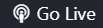
  2. ❗Open the [index-page](src/index.html) on the editor.❗
  3. Then click on the `Go Live` button. This will start the development server and open the application in your default browser.
      - ❓ If the server is not started yet, you will not see any events on the page ❓
      - To start the server, go to the [server-documentation](https://git.ti.howest.be/TI/2022-2023/s3/analysis-and-development-project/projects/group-02/server)
- If you work with **WebStorm IDE**
  1. Open the [index-page](src/index.html) on the editor.
  2. On the top right corner, you will see some browser icons: 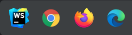
  3. Click on a browser icon. This will start the development server and open the application in your default browser.
     - ❓You must have the browser you want to open installed on your device. Otherwise it will give you an error that the browser is not installed.❓

***HOME page:** Server is **NOT** started yet*
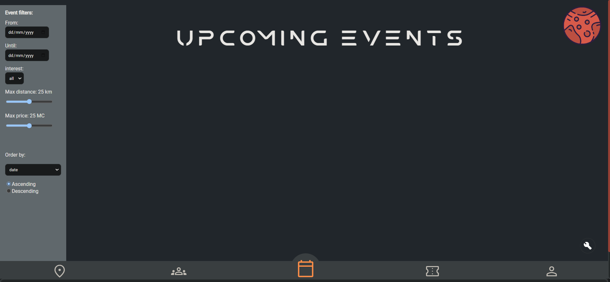

***HOME page:** Server is started*
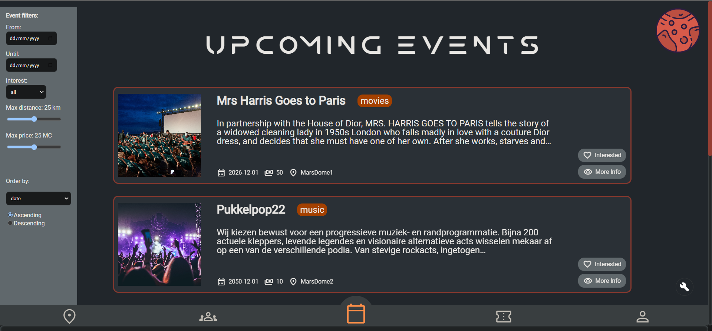

## 🌐 Technologies used

This project was built using the following technologies:

- [](https://nl.wikipedia.org/wiki/HyperText_Markup_Language)
- []()
- [](https://css3.com/)
- [](https://sass-lang.com/)
- [](https://www.javascript.com/)

## 📂 Folder structure

```md
├── images/
├── src/
│   ├── assets/
|   |     ├── css/
|   |     ├── fonts/
|   |     ├── js/
|   |     └── sass/
│   ├── images/
│   ├── config.json
│   ├── [HTML files]
├── .gitignore
├── .gitlab-ci.yml
├── .vnuignore
├── package-lock.json
├── package.json
├── README.md
└── sonar-project.properties
```

The images folder contains all the images used in the **README.md** file. So it is not the images for the application. The images for the application is located in [images](src/images/)

The src folder contains the source code for the project, including the HTML files, styles, and other JavaScript files.

## ❇️ Application

### Starting (home screen)


When our application starts, you will see the screen shown on the image above. All the events are loaded from the server.

----------------------------------------------------------------------------------------

### Homescreen aside  

| Image| Information|
|-------|-----------|
|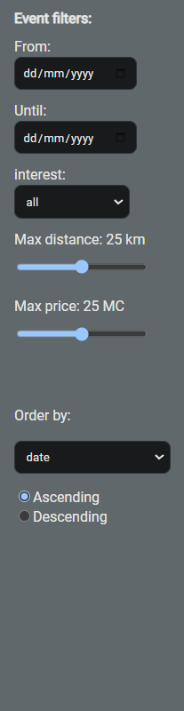| At the left side you will see an aside where you can filter the events. You can filter or order on the followings:<br><br>- **Filter by date**<br>- **filter by interests.**<br>- **Filter on distance** [***not yet implemented***]<br>- **Filter on price**<br>- **Order by date** *(first to last / last to first)*<br>- **Order by distance** *(closest to furthest / furthest to closest)*<br>- **Order by price** *(cheap to expensive / expensive to cheap*)|

----------------------------------------------------------------------------------------

### Event example

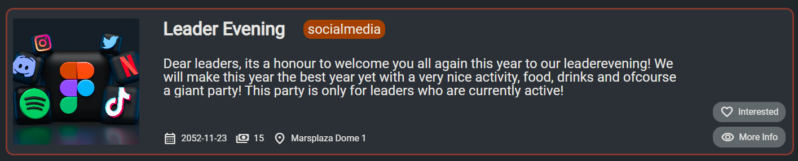

On the image above, you can see one event on the home screen. You can easily see the:

- title
- a short description
- date of the event
- price
- location
- action buttons
  - interested button:
    - 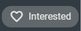
    - This button is for marking yourself as '**interested in that event**' .
  - More info button
    - 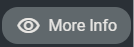
    - This button redirects you to the event information page.

----------------------------------------------------------------------------------------

### Admin / create event button

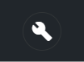
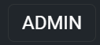

There is also a button for creating a new event. This button will be only accessible for the administrators / known consignors of Events United.

***Because this is a POC, we will be working as admin to show all the functions.***

----------------------------------------------------------------------------------------

### Footer


On the footer, there are 5 buttons:

- Map
- Friends
- Homescreen / events
- Tickets
- Profile

----------------------------------------------------------------------------------------

## 🖇️ Other pages

For further explanation of the other pages, click on the links

|Page|Location|
|:--|:--|
|Map|[Map](markdown/Map.md)|
|Friends|[Friends](markdown/Friends.md)|
|Tickets|[Tickets](markdown/Tickets.md)|
|Profile|[Profile](markdown/Profile.md)|

## 🔗 Links

💻 [Click here to go to the app!](https://project-ii.ti.howest.be/mars-02/)

📃 [server README](https://git.ti.howest.be/TI/2022-2023/s3/analysis-and-development-project/projects/group-02/server/-/blob/main/readme.md)

- Sonar reports: <https://sonar.ti.howest.be/dashboard?id=2022.project-ii%3Amars-client-02>


## 🎉 Contributors

The following individuals are the owners and maintainers of this project:

- [**Ali Mola**](https://git.ti.howest.be/ali.mola)
- [**Jara Puype**](https://git.ti.howest.be/jara.puype)
- [**Lukas Olivier**](https://git.ti.howest.be/lukas.olivier)
- [**Niels Soete**](https://git.ti.howest.be/niels.soete)
- [**Sam Roovers**](https://git.ti.howest.be/sam.roovers)

## 📨 Contact

If you have any questions or would like to get in touch with the team, please feel free to contact us at info.eventsunited@gmail.com or through our contact form on the following link: [contact form](https://tihowest.wixsite.com/project/contact)
