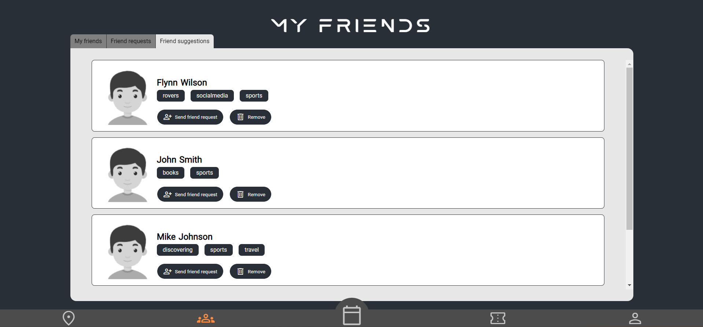

# Friends Page

Welcome to the Friends page for Events United. This page allows you to manage your friendships and connect with other users on the platform.

## My Friends

The **My Friends** section of the page displays a list of users who you have accepted as friends. You can send them messages, see their interests or remove as friend.

## Friend Requests

The **Friend Requests** section of the page displays a list of users who have sent you friend requests. You can accept or decline these requests as you see fit.

❌ ***[OUT OF SCOPE for POC]***

## Friend Suggestions

The **Friend Suggestions** section of the page displays a list of users who may be interested in connecting with you. You can see their interests, remove suggestion or send them friend requests if you wish.

## Privacy and Safety

Please be mindful of your personal privacy and safety when interacting with other users on the Friends page. Be cautious when accepting friend requests from strangers, and do not share personal information with anyone you do not trust.
