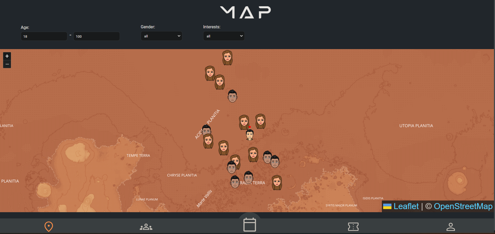
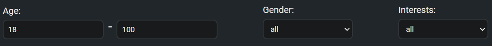

## Map

This is the documentation of the **MAP** page of our application. We added a map on our application because it is one of our needs. In our application, you can look on the map for other Martians and add them as a friend.

The main idea is that if any Martian goes to an event, he/she will be able to see the other Martians on the event map with their interests. So they can add each other as a friend and talk about their interested topic.

----------------------------------------------------------------------------------------

### Used technologies

|Badge|description|
|:--|:--|
|| an open-source JavaScript library for mobile-friendly interactive maps |
| Pure CSS3 popups and controls for easy restyling |

----------------------------------------------------------------------------------------

## Images

### main map

This is what our map looks like. It is clean and simple. The current user will see Martians around him/herself. He/she will be marked with a pointer in the middle of the map.

----------------------------------------------------------------------------------------

### map filters

We also added some options to filter for Martians. The filter options are:

    - Filter on age
      - minimum age - max age
    - Gender
      - filter on all genders
      - filter only on males
      - filter only on females
    - Interests
      - Filter on interests

If you filter something, the map will be updated directly.
