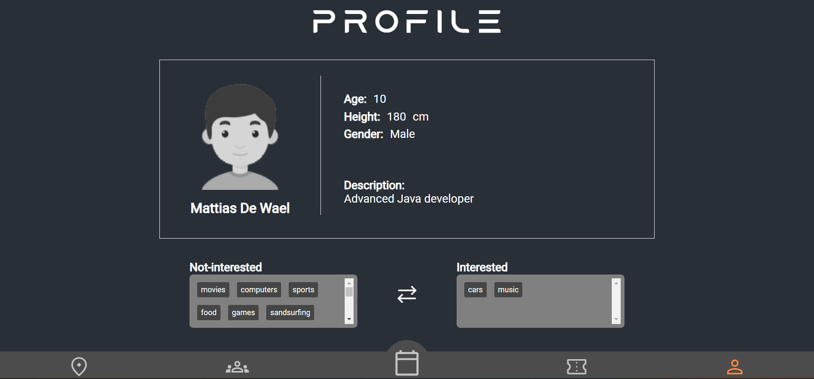
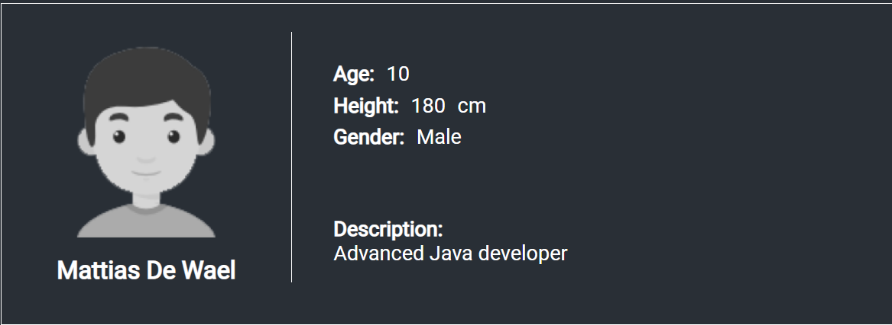
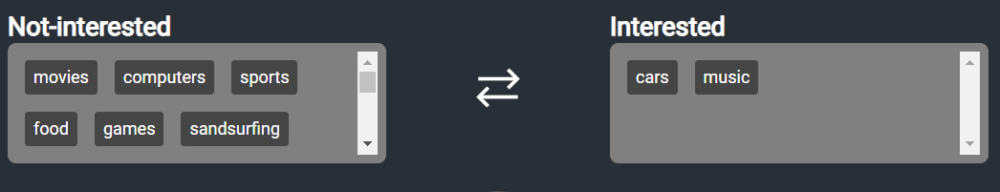
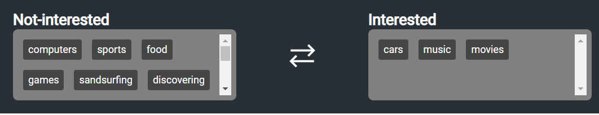
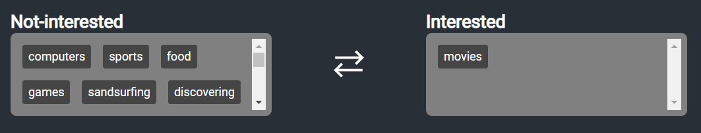

# Profile Page

Welcome to your Profile page on Events United. This page allows you to manage your personal information and settings, as well as view and interact with your content.

## Profile Picture

The profile picture is a visual representation of your identity on the platform. The image is automatically gathered from the bracelet on Mars.

## Personal Information

The "Personal Information" section of the page allows you to view your personal details such as your name, age, height, gender, bio, and interests.

## Drag and drop

> Dragging 'movies' to interests box

> Removing the interests

🪲 KNOWN BUG:

When you drag an interest out of the boxes, it disappears. It comes back when you refresh the page.
