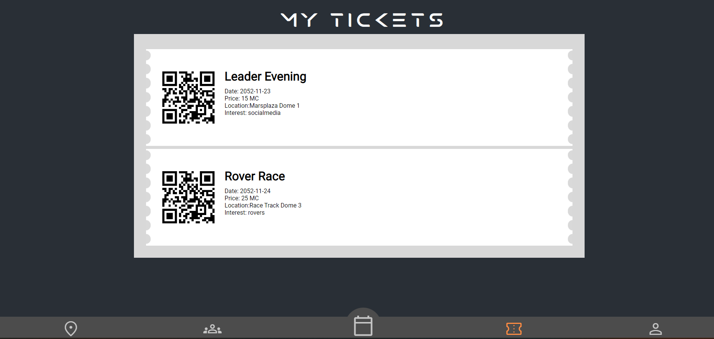

# Tickets Page

Welcome to the Tickets page for Events United. This page allows you to purchase tickets for events and view your ticket collection.

## Buying Tickets

To buy a ticket, simply browse the available events and click on the ***More Info*** button at an event on the home page. Then click on ***Buy Ticket*** button for the event you are interested in. You will be prompted to enter your payment information and complete the purchase. Once the purchase is complete, the ticket will be added to your ticket collection.

### How to buy a ticket

- Go to the home page
- Find an interesting event
- Click on the 'More Info' button
  - On this page, you have 3 buttons:
    - **Buy Ticket**
      - 
        - By clicking this button, you will be redirected to the payment page.
    - **Interested**
      -  --when clicked on it--> 
    - **Going**
      -  --when clicked on it--> 

### Button ***buy ticket*** clicked

> You will be redirected to the following page:

> here can you fill in the fields

❌ **The given values will not work [OUT OF POC SCOPE]**

> When clicked on the **Go to checkout** button , it will redirect you to the overview of the ticket

> When clicked on **Confirm**, money will be automatically deducted and the ticket is added to the list.

## Viewing Tickets

The ***My Tickets*** section of the page displays a list of all the tickets you have purchased. Each ticket includes the following information:

- **Title**: The title of the event
- **Date**: The date and time of the event
- **Price**: The price of the ticket
- **Location**: The location of the event
- **Interests**: A list of interests related to the event

