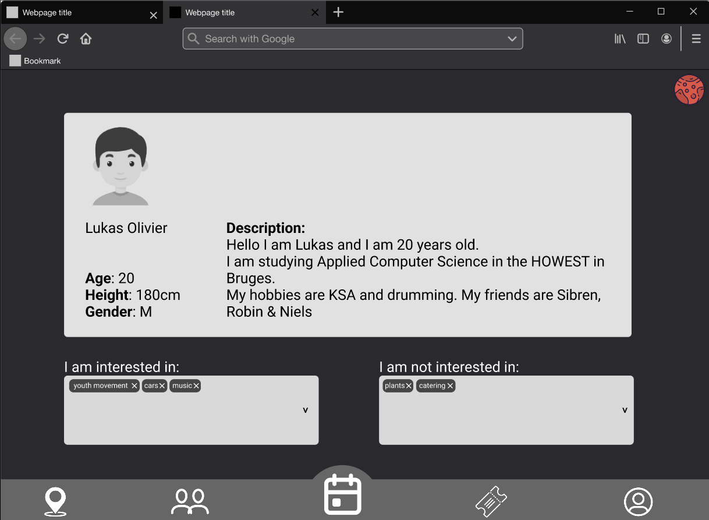
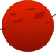

# Events United documentation

# Sonarlint

| Client | Server |
|:---|:---|
|       |        |
|  | |
| | |

# Badges

# Table Of Contents

- [Events United documentation](#events-united-documentation)
- [Sonarlint](#sonarlint)
- [Badges](#badges)
- [Table Of Contents](#table-of-contents)
  - [👀 About us](#-about-us)
  - [📜 Contents of the repository](#-contents-of-the-repository)
  - [💸 Business case](#-business-case)
  - [📐 Schematics](#-schematics)
  - [📏 Wireframes](#-wireframes)
  - [❇️ Features](#️-features)
  - [✅ Installation](#-installation)
    - [**For cloning the client using SSH**](#for-cloning-the-client-using-ssh)
    - [**For cloning the server using SSH**](#for-cloning-the-server-using-ssh)
  - [🔗 Links](#-links)
  - [🤝 Collaborators](#-collaborators)
  - [🎉 Contributors](#-contributors)
  - [✉️ Contact](#️-contact)

## 👀 About us

Events United is a startup company that organises events for Martians who are starting to feel bored, want to explore Mars, or simply want to make new friends. Our main goal is to bring people together and provide them with unique and engaging experiences.

Our events cater to a wide range of interests, and with the use of our innovative application, Martians are able to easily browse and attend events that suit their interests.

## 📜 Contents of the repository

  - 📈 Diagrams: A collection of diagrams and charts that help visualize the project architecture and design, including C4 diagrams, Entity-Relationship Diagrams (ERD), flowcharts, and User-Centered Design (UCD) diagrams.
  - 📄 Documents: The business case and schematics for the project.
  
  -  API Spec: The specification for the project's API, including details on available endpoints and request/response formats.
  - 📝Assignments: A list of project structure including the Feature List Proposal Presentation, Feature List Proposal, Human Resources, Moderated Usability Tests, and POC User Stories Proposal.

## 💸 Business case

Our business case outlines the justification and potential benefits of our proposed project. It includes a detailed analysis of the costs, risks, and expected outcomes of the plan. We believe that our project has the potential to bring significant value to our organization, and we are confident that the benefits will far outweigh any costs or risks.

> Our Business case can be found under '**Documents**' folder or as a pdf [click here to go to the Business case](https://docs.google.com/document/d/1n1R7tkWLFLv4a-cgSAm95vUCfnOfxf3b/edit?usp=sharing&ouid=107168093388043837318&rtpof=true&sd=true)
> 
## 📐 Schematics

- ### ***OpenAPI-spec***

Our OpenAPI spec can be found [here](https://git.ti.howest.be/TI/2022-2023/s3/analysis-and-development-project/projects/group-02/documentation/-/blob/main/api-spec/openapi-mars.yaml)

It consists total 16 endpoints:
>
> |Endpoint|function|
> |:---|:---|
> |***Endpoints for events***|
> |/api/events|return all events|
> |/api/events/{eventId}|return a specific event|
> |/api/events/create|create a new event|
> |/api/users/{userId}/{eventId}/ticket/buy|buy a ticket for an event|
> |/api/users/{userId}/{eventId}/interested/add|add a user as interested in an event|
> |/api/users/{userId}/{eventId}/interested/remove|remove interested in an event|
> |/api/users/{userId}/tickets|return tickets of an user|
> |***Endpoints for users***|
> |/api/users|return all users|
> |/api/users/{userId}|return all information about a specific user|
> |/api/users/{userId}/interests|return the interests of specific user|
> |/api/users/{userId}/{interest}/interests/add|add an interest for a specific user|
> |/api/users/{userId}/{interest}/interests/remove|remove an interest from a specific user|
> |/api/users/{usersId}/friends|return the friends of a specific user|
> |/api/users/{usersId}/{friendId}/friends/add|add friend to a specific user|
> |/api/users/{usersId}/{friendId}/friends/remove|remove friend from a specific user|
> |***Endpoints for interests***|
> |/api/interests|return all interests|

- ### ***Flowcharts***

In our project, we have utilized flowcharts to visually represent and document the various processes and workflows involved. These flowcharts have proven to be an invaluable tool in understanding and improving the efficiency of our project, and we highly recommend their use in similar projects.

Our flowcharts can be found under **Diagrams>FlowCharts** or [click here](Diagrams/FlowCharts/)

- ### ***User-Centered Design (UCD)***

- ### ***C4 diagrams***

  - C4 - Deployable
  
  - C4 - System context
  

- ### ***ERD***

  

## 📏 Wireframes

> In our project, we have used wireframes to plan and communicate the structure and layout of our website or application. These wireframes have helped us understand and refine the user experience, and have allowed us to identify and address potential issues or challenges early in the development process. We have found wireframes to be an invaluable tool in the design process, and we highly recommend their use in similar projects.
>
> We created our wireframes on Figma. You can find them via the following link: [Events United Wireframes](https://www.figma.com/proto/9gZb0vmaUJET2lctdHQZ0u/Events-United-Application?node-id=1273%3A1164&starting-point-node-id=1673%3A10874)

- Main page:

- Map:

- Friends:

- Tickets

- Profile

***The images above is what our application will look like.***

## ❇️ Features

  - ### Push notification

    
      - For our push notification, we use the [notification API](https://developer.mozilla.org/en-US/docs/Web/API/Notifications_API) from [Javascript](https://developer.mozilla.org/en-US/docs/Web/API/Notification).
      - You will receive a notification when someone wants to add you as friend.

  - ### Drag-and-drop

    
      - In our application, you can make use of drag and drop feature. It is used in the 'Profile' page where you can drag and drop interests. We use [HTML Drag and Drop API](https://developer.mozilla.org/en-US/docs/Web/API/HTML_Drag_and_Drop_API).

  - ### Map 

    
      - We use leaflet for for showing the map. You can easily locate yourself and you can add a pointer/marker on a specific place.

  - ### Sass

    
      - We write our css with sass.

## ✅ Installation

Our Proof of Concept (POC) gives you a preview of what the final app will look like. While the POC closely resembles the actual app, there are always opportunities for improvement. This allows us to make any necessary adjustments before fully launching the app.

For the installation of our application, you just have to clone the both repositories.

*You can do that by the following:*

### **For cloning the client using SSH**

    > git clone git@git.ti.howest.be:TI/2022-2023/s3/analysis-and-development-project/projects/group-02/client.git

### **For cloning the server using SSH**

    > git clone git@git.ti.howest.be:TI/2022-2023/s3/analysis-and-development-project/projects/group-02/server.git

  - ***❓Cloning using HTTPS will not work because our repository is private and only accessible using ssh keys authorized by gitlab of Howest.***

## 🔗 Links

💻 [Click here to go to the app!](https://project-ii.ti.howest.be/mars-02/)

📃 [client README](https://git.ti.howest.be/TI/2022-2023/s3/analysis-and-development-project/projects/group-02/client/-/blob/main/README.md)

📃 [server README](https://git.ti.howest.be/TI/2022-2023/s3/analysis-and-development-project/projects/group-02/server/-/blob/main/readme.md)

📃 [Click here to go to the Business Model Canvas](https://miro.com/app/board/uXjVPPCQHCk=/?share_link_id=742412303756)

  -  🌐 Our project has a website hosted on Wix. Click the badge to visit the site.

  - 📗 Our project uses Swagger, an API development tool. Click the badge to access the Swagger documentation for our API.
  

  - 📐 Our project uses Figma, a design and prototyping tool. Click the badge to view our Figma prototype.

## 🤝 Collaborators

  > For a better working of our application, we have some collaborators. Click on the images for their webpage.

  
  
  

## 🎉 Contributors

The following individuals are the owners and maintainers of this project:

- [**Ali Mola**](https://git.ti.howest.be/ali.mola)
- [**Jara Puype**](https://git.ti.howest.be/jara.puype)
- [**Lukas Olivier**](https://git.ti.howest.be/lukas.olivier)
- [**Niels Soete**](https://git.ti.howest.be/niels.soete)
- [**Sam Roovers**](https://git.ti.howest.be/sam.roovers)

## ✉️ Contact

If you have any questions or would like to get in touch with the team, please feel free to contact us at info.eventsunited@gmail.com or through our contact form on the following link: [contact form](https://tihowest.wixsite.com/project/contact)
